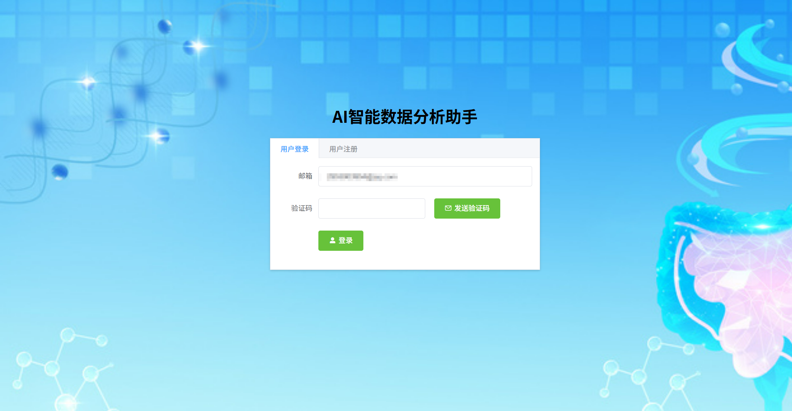
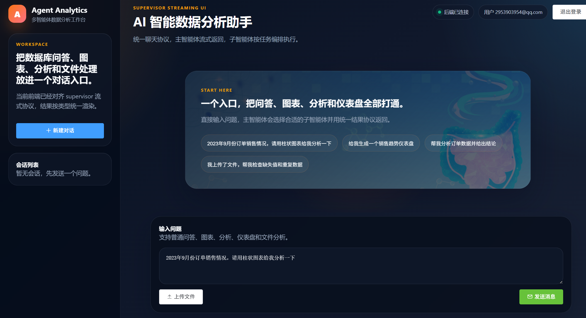
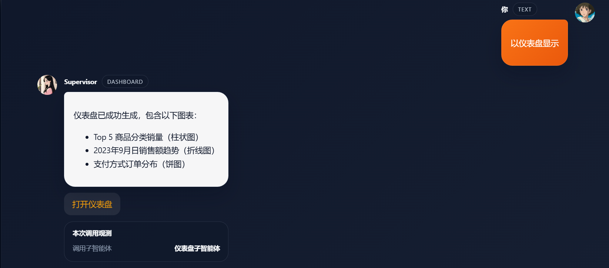
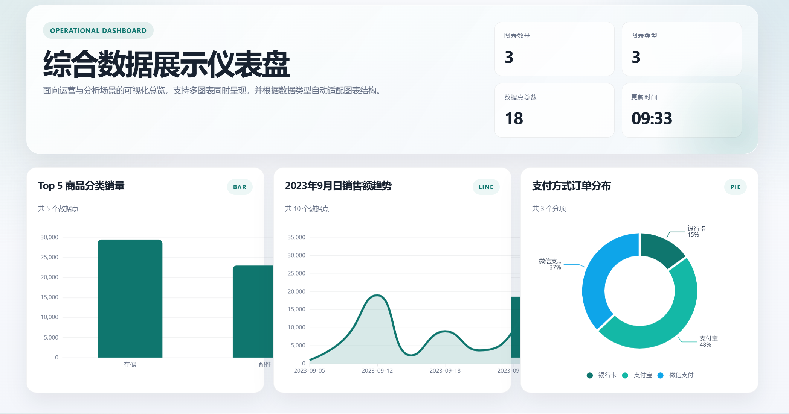

# Agent Analytics Frontend

Vue 2 + Element UI 前端项目，用于承接多智能体数据分析后端的统一聊天协议。当前前端已经对齐 `supervisor` 流式返回模式，支持登录、聊天、图表展示、分析结果展示、仪表盘跳转和文件上传。

## 页面预览

### 登录页



### 主聊天工作台



### 聊天中的仪表盘结果



### 独立仪表盘页面



## 前端能力

- 邮箱验证码登录
- 基于 SSE 的流式聊天
- 统一消息协议渲染
- 普通文本回答渲染
- ECharts 图表渲染
- 表格 + 分析文本 + 图表组合渲染
- 仪表盘链接跳转
- 文件上传并在后续聊天自动携带 `file_path`
- 显示本次请求调用了哪些子智能体

## 主要页面

### `Login.vue`

- 登录入口页
- 通过 `/send_email` 发送验证码
- 通过 `/login` 校验登录
- 登录成功后把邮箱写入 `localStorage.user_id`
- 跳转到 `/chat`

### `Chat.vue`

- 统一聊天工作区
- 调用 `GET /chat/stream`
- 通过 `EventSource` 接收主智能体流式输出
- 根据 `type` 区分渲染 `text`、`chart`、`analyze`、`dashboard`、`file`
- 显示 `meta.agentCalls`，用于观察本次实际调用的子智能体

## 路由结构

```text
/       -> Login
/chat   -> Chat
```

## 技术栈

- Vue 2
- Vue Router
- Element UI
- Axios
- Marked
- DOMPurify
- ECharts
- Webpack 3

## 与后端的接口协作

前端默认对接本地后端：

- 后端地址：`http://localhost:8000`
- 前端地址：`http://localhost:8080`

### 1. 登录

- `POST /send_email`
- `POST /login`

### 2. 聊天

- `GET /chat/stream`

请求参数：

- `question`
- `user_id`
- `file_path`，可选

SSE 事件格式：

```json
{"event":"chunk","type":"text","content":"...","meta":{"agentCalls":[]}}
{"event":"final","type":"text|chart|analyze|dashboard|file","payload":{},"meta":{"agentCalls":["chart_specialist"]},"done":true}
{"event":"error","content":"...","meta":{"agentCalls":["sql_specialist"]},"done":true,"error":true}
```

### 3. 上传文件

- `POST /upload`

上传成功后前端会保存：

- `file_path`
- `file_name`
- `file_id`

后续继续聊天时，若存在 `file_path`，会自动追加到聊天请求中。

## 统一消息渲染规则

### `text`

- Markdown 气泡展示

### `chart`

- 文本说明 + ECharts 图表

### `analyze`

- 表格 + Markdown 分析结果 + 图表

### `dashboard`

- 说明文本 + 仪表盘访问链接

### `file`

- 文件处理说明 + 下载链接

## 项目结构

```text
chat_agent/
├─ build/
├─ config/
├─ docs/
│  └─ screenshots/
├─ src/
│  ├─ assets/
│  │  ├─ css/
│  │  └─ image/
│  ├─ components/
│  │  └─ page/
│  │     ├─ Chat.vue
│  │     └─ Login.vue
│  ├─ router/
│  │  └─ index.js
│  ├─ App.vue
│  └─ main.js
├─ index.html
├─ package.json
└─ README.md
```

## 本地启动

### 安装依赖

```bash
npm install
```

### 启动开发环境

```bash
npm run dev
```

默认访问地址：

- `http://localhost:8080`

### 打包构建

```bash
npm run build
```

## 当前实现特点

- 前端已经不再按关键词分多套请求逻辑
- 聊天主入口统一为 `/chat/stream`
- 页面展示风格已调整为深色数据工作台
- 仪表盘结果既可在聊天里展示，也可跳转到独立仪表盘页面
- 观测面板只显示“调用了哪些智能体”，不再显示 token

## 说明

- 本项目是前端子项目，Python 依赖不在这里管理
- 后端依赖与主项目说明请查看后端仓库根目录的 `README.md`
